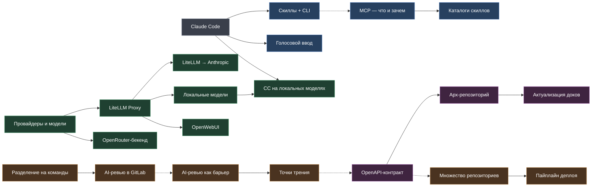

## Карта материалов

Не дерево, а граф: материалы связаны между собой (что из чего вытекает, что чем
дополняется). Кликните узел — попадёте в статью. Цвет — раздел.

**Разделы:** ● Старт · ● Инструменты · ● Инфраструктура (модели и доступ) · ● Процессы · ● Архитектура

Сплошная стрелка — «вытекает из / нужно для», пунктир — смысловая связь между темами.
Пока почти всё в черновиках (видно в `dev`, скрыто в прод-сборке) — наполняем по мере готовности.
