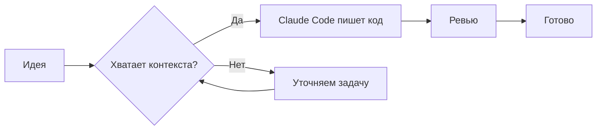
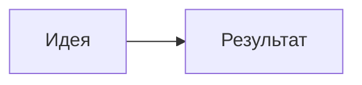

Схемы делаем не картинками, а **кодом**: описываешь диаграмму текстом в блоке
` ```mermaid `, она рендерится прямо на странице и легко правится в любой статье.

## Превью



## Как вставить

Просто пишешь блок с языком `mermaid` — рендер клиентский, тема (светлая/тёмная)
подхватывается автоматически.

````md

````

## Заметки

- Синтаксис диаграмм — в [документации Mermaid](https://mermaid.js.org/).
- Рендер происходит в браузере после загрузки страницы: на больших диаграммах
  возможна короткая перерисовка.
